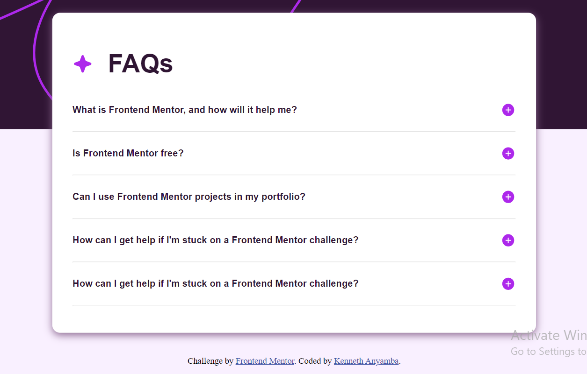

# faq-accordion

- [Overview](#overview)
  - [The challenge](#the-challenge)
  - [Screenshot](#screenshot)
  - [Links](#links)
- [My process](#my-process)
  - [Built with](#built-with)
  - [What I learned](#what-i-learned)
  - [Continued development](#continued-development)
  - [Useful resources](#useful-resources)
- [Author](#author)
- [Acknowledgments](#acknowledgments)

## Overview

### The challenge

Users should be able to:

- Hide/Show the answer to a question when the question is clicked
- Navigate the questions and hide/show answers using keyboard navigation alone
- View the optimal layout for the interface depending on their device's screen size
- See hover and focus states for all interactive elements on the page

### Screenshot

- Solution URL: [Add solution URL here](https://your-solution-url.com)
- Live Site URL: [Add live site URL here](https://your-live-site-url.com)

## My process

### Built with

- Semantic HTML5 markup
- CSS
- Flexbox
- CSS Grid
- Mobile-first workflow

### What I learned

I The most remarkable experience in this project is working DOM manipulation. It is my first time working solo on DOM. I thought I have mastered until this project proved otherwise.

I learnt a new syntax the `nextSiblingElement` from chatGPT.

My knowledge of CSS Box Model was tested and reinforced. CSS is like a puzzle with unwritten rules. I struggled with keeping the accordion at the center.

### Continued development

I have to learn more about CSS Box Model and DOM manipulation. I also had issues importing fonts. I can't say what the problem is.

## Author

- Frontend Mentor - [@kenn-eth](https://www.frontendmentor.io/profile/Kenn-eth)

- Email - [Kenneth Anyamba](anyambakenneth@gmail.com)

## Acknowledments

- Faith Njah for giving me CSS tips that helped improve my web page responsiveness.

- ChatGPT for responding to all my prompts.
